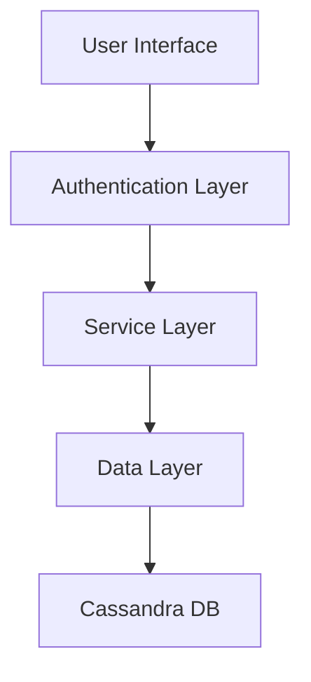

# Vicharcha Application Architecture

## System Overview
Vicharcha is a comprehensive social platform with multiple features and services.

## Core Components

### Frontend Components
- **Navigation**
    - Desktop Sidebar
    - Mobile Navigation Bar
    - Theme Switcher
    - Logout Button

### User Interface Modules
1. **Authentication**
     - Login with OTP
     - Cassandra-based session management
     
2. **Social Features**
     - Home Feed
     - Messages
     - Reels
     - AI Assistant
     
3. **User Features**
     - Profile Management
     - Account Settings
     - Research Section
     - Emergency Services
     
4. **Commerce Features**
     - Shopping Interface
     - Payment Processing

## Database Architecture
- Primary Database: Apache Cassandra
    - User Authentication
    - Session Management
    - Profile Data Storage

## Security Features
- OTP-based Authentication
- Secure Payment Gateway
- Session Management
- Data Encryption

## Service Architecture

## Performance Considerations
- Mobile-first responsive design
- Optimized data fetching
- Cached frequent operations
